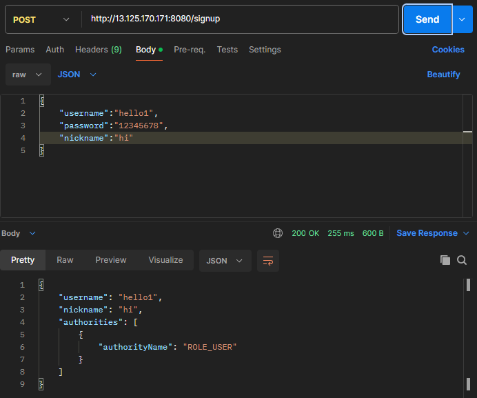
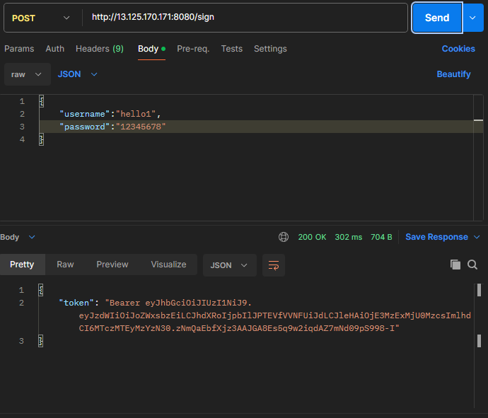
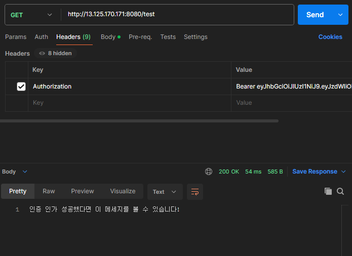
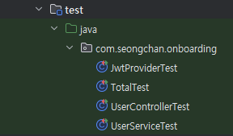
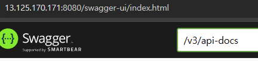
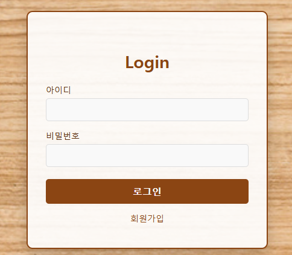
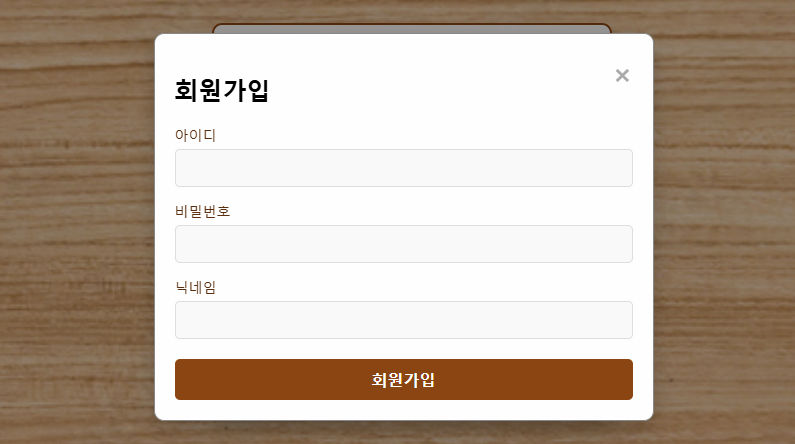
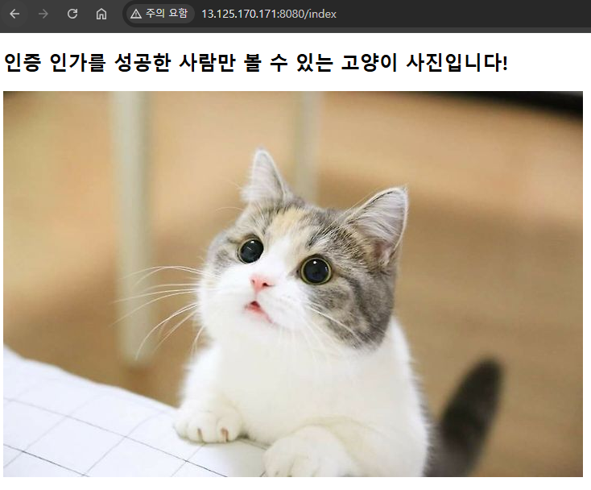
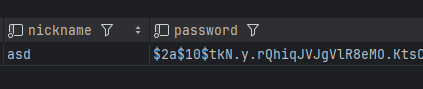

# 백엔드 개발 온보딩 과제 (Java)
### 현재 EC2 내 배포 완료
### [13.125.170.171:8080](http://13.125.170.171:8080)

---
## 💻 개발 환경
- Version : Java 17
- IDE : IntelliJ
- Framework : SpringBoot 3.3.0
- ORM : JPA
---
## ⚙️ 기술 스택
- Computing : AWS EC2
- DataBase : AWS RDS (MySQL)
- Cache : ElastiCache (Redis)
---
## 🎤 사용 예제
### 🧑‍🤝‍🧑 회원가입

### 🗝️ 로그인

### 🐈 (추가) 발급된 토큰을 헤더에 포함할 때 볼 수 있는 메서드

---
## 🎸 기타
### 🧪 테스트 코드 작성 완료

### 🛠️ Swagger 접속 가능

### 🖥️ 프론트 구현

### 패스워드는 암호화되니 안심하고 테스트하세요!
